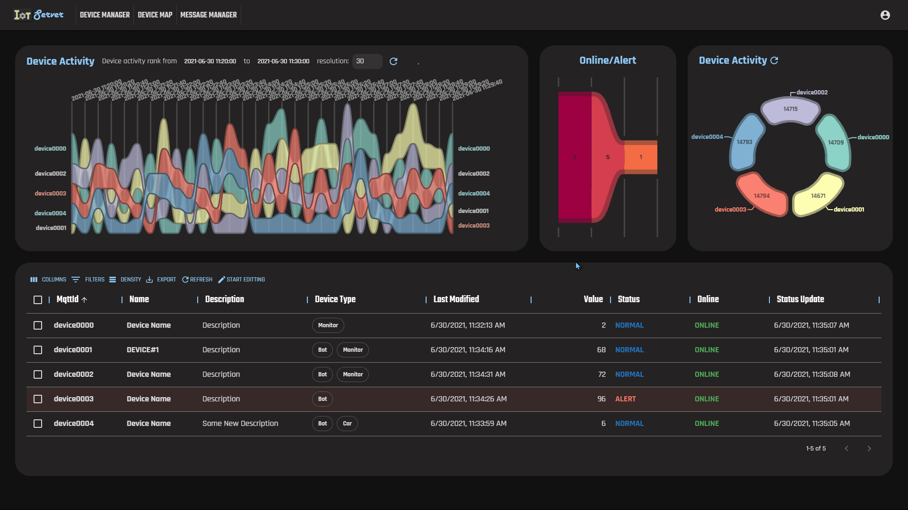

# IoTServer: 物联网应用管理网站


- 课程名称：B/S 体系软件设计
- 姓名：徐震
- 学院：竺可桢学院
- 专业：混合班（计算机科学与技术）
- 学号：3180105504
- 指导老师：胡晓军


项目地址：

- 前端：https://github.com/dendenxu/iotserver-front

- 后端：https://github.com/dendenxu/iotserver

- IoT设备模拟器：https://github.com/dendenxu/iotclient

    （添加了lastwill与connect消息等客制化功能）

- 预览地址：https://neon-cubes.xyz:5001/


2021年5月6日


PS：千言万语汇成几个动图，因此本文档最好在支持动图渲染的MarkDown编辑器中审阅


## 使用手册

我们的项目包括了前端、后端以及IoT设备模拟器等多类别的客制化内容，为了描述方便，我们将在后续手册中用`iotserver`来称呼项目后端源码根目录，`iotserver-front`代指前端，`iotclient`代指IoT设备模拟器


### 使用环境

由于我们使用`spring-boot`和`java`进行了后端开发，并以`React`为框架进行了前端开发，本项目可在不同系统上正常运行，作者详细测试了

- ***Ubuntu***或***CentOS***的linux发行版上的使用，开发情况
- ***Windows 10***外加***Docker***上的使用，开发情况

我们将主要以Ubuntu为例介绍各项依赖的安装

#### 数据库

项目使用***MongoDB***作为主要数据库

- 请参考[MongoDB的官方安装指导](https://docs.mongodb.com/manual/installation/)安装MongoDB，在不同Linux发行版上与Windows上这一步基本都是相同的

    我们希望您将MongoDB开放在默认的27017端口下，并不要设置身份验证，否则后续的数据库填充脚本将无法正常工作

- 安装完成并验证MongoDB可以正常运行后，请运行`iotserver`根目录下的`iotserver/populate_db.sh`来加载我们预先提供的样例数据

- 若加载失败，请检查报错信息

    若您的MongoDB开放在不同的端口上，或者使用了身份验证机制，请根据[mongorestore的官方使用手册](https://docs.mongodb.com/database-tools/mongorestore/)修改`iotserver/populate_db.sh`中的

    ```bash
    ...
    INDEX_IOTSERVER=$(mongo --quiet --eval "db.getMongo().getDBNames().indexOf('iotserver');");
    ...
    mongorestore "${DB_FILE_BASE}";
    ...
    ```

- 加载完成后，您应该看到相应的成功提示，并能够在MongoDB的iotserver数据库中看到一些样例数据

    例如，执行下列指令后您应该可以看到一些结果

    ```bash
    mongo iotserver --eval "db.ioTMessage.find({mqttId: 'device0000'}).sort( { date: -1 } ).limit(5)"
    ```

    ```javascript
    { "_id" : ObjectId("60dacef6f04f5051342e03ad"), "mqttId" : "device0000", "email" : "3180105504@zju.edu.cn", "info" : "Device Data 2021/06/29 15:42:46", "value" : 13, "alert" : 0, "lng" : 120.33758344650269, "lat" : 30.33182578086853, "date" : ISODate("2021-06-29T07:42:46.784Z"), "_class" : "com.neoncubes.iotserver.IoTMessage" }
    { "_id" : ObjectId("60daceeef04f5051342e03a7"), "mqttId" : "device0000", "email" : "3180105504@zju.edu.cn", "info" : "Device Data 2021/06/29 15:42:38", "value" : 6, "alert" : 0, "lng" : 120.22832480669022, "lat" : 30.109348726272586, "date" : ISODate("2021-06-29T07:42:38.189Z"), "_class" : "com.neoncubes.iotserver.IoTMessage" }
    { "_id" : ObjectId("60dacee9f04f5051342e03a1"), "mqttId" : "device0000", "email" : "3180105504@zju.edu.cn", "info" : "Device Data 2021/06/29 15:42:33", "value" : 27, "alert" : 0, "lng" : 120.09050310850144, "lat" : 30.26041557788849, "date" : ISODate("2021-06-29T07:42:33.187Z"), "_class" : "com.neoncubes.iotserver.IoTMessage" }
    { "_id" : ObjectId("60dacee7f04f5051342e03a0"), "mqttId" : "device0000", "email" : "3180105504@zju.edu.cn", "info" : "Device Data 2021/06/29 15:42:31", "value" : 88, "alert" : 1, "lng" : 120.48855912685394, "lat" : 30.421336603164676, "date" : ISODate("2021-06-29T07:42:31.875Z"), "_class" : "com.neoncubes.iotserver.IoTMessage" }
    { "_id" : ObjectId("60dacedff04f5051342e0397"), "mqttId" : "device0000", "email" : "3180105504@zju.edu.cn", "info" : "Device Data 2021/06/29 15:42:23", "value" : 19, "alert" : 0, "lng" : 120.262087059021, "lat" : 30.459150576591494, "date" : ISODate("2021-06-29T07:42:23.431Z"), "_class" : "com.neoncubes.iotserver.IoTMessage" }
    ```

#### 数据结构服务器

项目使用***Redis***作为In-Memory Data Store提高某些操作的响应速度

- 请参考[Redis的官方安装指导手册](https://redis.io/download)安装Redis

- Windows用户方面稍为麻烦，我们推荐使用Docker创建Redis的运行环境，请参考[Docker的官方指导](https://hub.docker.com/_/redis/)进行相关配置，若连接遇到问题请参考[这篇文章](https://koukia.ca/installing-redis-on-windows-using-docker-containers-7737d2ebc25e)

- 安装完成后您可以通过`sudo systemctl start redis`等方式启动它（各类发行版的具体指令不同）

- 启动成功您应该可以通过如下指令连接到redis

    ```bash
    redis-cli
    # 您应该看到
    # 127.0.0.1:6379> 
    ```

#### Mqtt Broker

项目开发过程中使用***Eclipse Mosquitto***作为Mqtt Broker用以进行IoT客户端与后端服务器的交互

因此我们需要在运行环境下安装该Broker

- 同样的，请参考Eclipse的[官方指导](https://mosquitto.org/download/)安装Mosquito

- 安装完成后您可以通过`sudo systemctl start mosquito`等方式启动它（各类发行版的具体指令不同）

- 启动成功后您可以通过

    ```bash
    netstat -plant | grep 1883
    # tcp        0      0 0.0.0.0:1883            0.0.0.0:*               LISTEN      9460/mosquitto
    # tcp        0      0 127.0.0.1:1883          127.0.0.1:57688         ESTABLISHED 9460/mosquitto
    # tcp6       0      0 :::1883                 :::*                    LISTEN      9460/mosquitto
    ```

    来观察Mosquito是否已经在正常监听1883端口

#### JRE/JDK Java

项目使用Java与Spring-Boot进行后端部署，我们使用OpenJDK 16进行开发

- 您需要至少安装Java SE 16，[Oracle的官网提供了相关安装地址](https://www.oracle.com/java/technologies/javase-downloads.html)

- 同时，若您希望检查并修改我们的具体实现，您需要安装[OpenJDK 16](https://jdk.java.net/16/)

- 您可以通过

    ```bash
    java --version
    # java 16.0.1 2021-04-20
    # Java(TM) SE Runtime Environment (build 16.0.1+9-24)
    # Java HotSpot(TM) 64-Bit Server VM (build 16.0.1+9-24, mixed mode, sharing)
    ```

    来检查Java是否被正确安装了

### 运行部署

我们分别在`iotserver-front`和`iotserver`提供了可供直接运行的前后端

- 后端程序通过Spring-Boot管理，无需额外配置

- 但由于前端内容使用React进行完全动态页面跳转，需要您对您最喜爱的服务器进行简单配置

    我们推荐您使用`npm`提供的`serve`包来预览

#### NPM安装

您可以参考[这篇文章](https://www.freecodecamp.org/news/how-to-install-node-js-on-ubuntu-and-update-npm-to-the-latest-version/)来安装Node和npm

- 安装成功后您应该可以通过如下指令进行验证

    ```bash
    node -v
    # v14.17.1
    npm -v
    # 6.14.13
    ```

#### 后端部署

- 我们将在`iotserver/build/`中提供已经提前编译好的后端框架，您可以通过

    ```bash
    java -jar iotserver/build/iotserver-0.0.1-SNAPSHOT.jar
    ```

    来运行该框架

- 若正常运行，您应该能看到一些调试信息

    ```bash
     :: Spring Boot ::                (v2.5.0)                                                                                                                                                                                                                2021-06-29 21:55:00.423  INFO 14060 --- [           main] c.n.iotserver.IoTServerApplication       : Starting IoTServerApplication v0.0.1-SNAPSHOT using Java 16.0.1 on neon-cubes-1.localdomain with PID 14060 (/root/iotserver-0.0.1-SNAPSHOT.jar started by root in /root)
    ...
    2021-06-29 21:55:29.673  INFO 14060 --- [           main] o.s.b.a.ApplicationAvailabilityBean      : Application availability state ReadinessState changed to ACCEPTING_TRAFFIC
    2021-06-29 21:55:29.674  INFO 14060 --- [           main] c.n.iotserver.IoTServerApplication       : The main program has started
    ```

- 这意味着我们的后端已经成功在`localhost:8080`运行

- 您可以尝试访问http://localhost:8080/api/account/auth，如果您看到`You're not logged in.`

    说明服务器已经在正常运行


#### 前端部署

相信您已经安装了`npm`

- 我们需要创建一个简单的服务器，您可以通过`npm install -g serve`来安装`serve`

- 在`iotserver-front/build`中我们提供了预编译的前端（并配置了`api`接口为`localhost:8080`）

- 您可以通过如下指令来启动`iotserver-front`

    ```bash
    serve -s build
    #
    #  ┌───────────────────────────────────┐
    #  │                                   │
    #  │   Serving!                        │
    #  │                                   │
    #  │   Local:  http://localhost:5000   │
    #  │                                   │
    #  └───────────────────────────────────┘
    ```

- 此时，您可以通过浏览器访问http://localhost:5000来观察前端是否正常运行

#### Demo服务器

若上述步骤中出现了问题，您可以直接到https://neon-cubes.xyz:5001/来观看我们的项目演示


## 功能测试与使用指导

#### 注册账户

**请参见登陆账户部分的动图**

- 在浏览器访问`iotserver`后，您将首先看到登录的主界面
- 由于您当前还未申请账号，我们可以点击Register Account来申请一个新的账号
- 您可以在输入框中输入您的邮箱，输入框支持浏览器的智能提示，因此您此前在其他网站注册留下的模式会得到相应的提示与自动补全
- 您可以通过下拉框来选择将要注册的用户类型，这里我们选择普通用户
- 我们对邮箱的格式进行了检查，不满足正常邮箱的输入会被标红提示
- 我们对用户输入的密码也进行了检查，要求字符数不少于8位，同时注册时的密码确认和输入密码要一致
- 若用户有输入框没有填写完成就进行注册，我们会给予相应提示
- 同时，我们提供了是否显示已经输入的密码的选择框
- 注意，由于我们已经成功在数据库中插入了数据，这里使用这组属性进行注册时，`iotserver`会发现该用户的邮箱和我们已经注册过的一个用户重复了，于是拒绝进行注册
- 我们预先提供的测试账户是：
    - 3180105504@zju.edu.cn
    - 88888888
- 让我们换一个邮箱进行注册
- 成功了，并跳转到登陆界面

#### 登陆账户

- 让我们尝试登录刚刚注册过的账户
- 这里同样会进行邮箱格式的检查并提示用户输入的邮箱格式不正确
- 当我们尝试登陆并未注册过的账号时，`iotserver`将会拒绝登录并给出提示
- 我们设计了加载界面，让用户能清晰地认识到自己当前的进度，并判断卡顿是否来源于网络连接
- 同时，我们支持在输入邮箱后直接敲击回车进入下一阶段
- 输入密码时，我们同样提供了是否显示密码的选择框
- 当输入密码不正确时，我们会提示用户
- 值得注意的是，我们在后端通过cookie进行用户身份验证，并通过redis高速缓存加速用户信息的加载
    - 因此您可以获得和绝大部分需要登陆的网站一样的使用体验
    - 我们还支持多个用户登录同一个账号的并发操作
    - 我们在后端通过详尽的增删改查管理，以及事务管理保证了用户数据不会发生冲突


#### 添加设备

登陆后我们会看到当前用户的设备管理主界面


由于这个用户什么设备都没有添加过，我们将看不到任何设备，让我们来尝试添加设备

- 我们可以通过点击Start Editing来进入编辑模式，这样同时可以暂停数据的自动刷新

- 接着，点击Add Device按钮可以在设备管理表格中添加新的设备

- 双击进入单元格后可以修改设备相关属性

- 同时我们还支持标签化的标记不同的设备类型

- 新添加的，且未保存到云端的设备会以橙色底色显示

- 数据表的左侧选择栏可以让我们批量对设备进行创建/保存，删除的操作

- 修改完成后，我们可以点击Create来尝试添加设备

- 当添加遇到问题时，我们会提示用户，例如我们的第一个设备的MqttId和其他用户设备的MqttId重复了

    - 这里发生重复的原因在于我们配置使用环境时已经添加了一些设备

    - 要求MqttId全局唯一的原因在于服务器通过MqttId唯一标识所有设备的Mqtt通信

        不同用户的所有设备都将与Mosquito Broker通过Mqtt协议进行通信，而协议中的唯一身份辨识符就是MqttId

    - > The client identifier (ClientId) **identifies each MQTT client** that connects to an MQTT broker. The broker uses the ClientId to identify the client and the current state of the client.Therefore, this Id should be unique per client and broker. In MQTT 3.1.1 you can send an empty ClientId, if you don’t need a state to be held by the broker. The empty ClientId results in a connection without any state. In this case, the clean session flag must be set to true or the broker will reject the connection.

    - 为了让用户在Client端不做额外配置，我们希望用户使用全局唯一的Device MqttId

- 批量进行添加操作时，先出现的错误也不会影响其他实体的操作，同时相应的错误也会提示给用户

- 添加成功的设备以半透明黑色的底色表示，且Action栏的内容从Create变为Save

- 在第一次添加成功后，用户可以继续进行添加，编辑操作

- 添加成功后设备信息汇总表格会自动更新

    - 设备活动数据会显示当前用户所有设备的统计状态
    - 同时该用户设备数量也会立刻得到更新


#### 登陆状态

`iotserver`通过cookie来管理用户的登录状态

- 用户无操作静止一段时间后，登陆状态会失效，此时用户尝试访问主界面会看到访问被拒绝
- 同时，访问被拒后页面会自动倒计时5秒，结束后自动跳转到登陆界面让用户重新登陆


#### 登出账户

- 我们在个人账户信息栏下提供了登出当前账户的接口
- 登出后将会直接跳转到登陆界面


#### 修改设备

由于我们已经在数据库添加了一些演示数据，让我们直接登录数据库提供的账号

- 3180105504@zju.edu.cn
- 88888888

来观察修改数据的相关内容

- 修改设备同样支持批量操作
- 编辑任何单元格后`iotserver`都会用浅蓝色底色标记当前设备，表示用户对该设备进行了修改但还未保存到云端
- 批量操作后设备的Save按钮会变暗，表示保存成功，若出错则会弹出红色框提示用户


- 注意，修改设备的MqttId会让`iotserver`认为当前用户要创建一个新的设备
- 点击刷新后会发现该用户成功创建了一个新的设备


#### 删除设备

用户在选中设备后可以直接删除它们

- 类似的，删除操作也支持批量进行

- 值得注意的是，在各类批量操作中，我们进行的都是异步通信

    在BS体系应用下，网络环境往往是延迟的最大来源

    因此异步进行多个设备的操作可以大大减小用户等待时间

    一种更为优化的设计是，调整后端接口，对批量操作直接进行一次请求


#### 设备状态

为了看出设备状态变化，我们对`iotclient`做出了如下修改

- 添加了`maven` Wrapper生成工具

- 添加了connect, lastwill, disconnect三个状态变化的topic

- 添加了`mqttClient.close()`的清理工作

- 添加了随机下线的运行循环

    ```java
    firstmessage = false;
    if (lastmessage) {
        running = false;
        lastmessage = false;
    } else {
        // 0.1 to disconnect
        float RR = rand.nextFloat();
        if (RR < 0.1) {
            lastmessage = true;
        }
    }
    ```

- 修改了一些变量名以符合IoT的格式

- 修改了随即等待的时间为毫秒级别连续变化的

让我们在后台启动`iotclient`，在`iotclient/target`下会提供预编译好的`iotclient-1.0.0.jar`，可使用如下方式启动`iotclient`

注意

- `iotclient`要能够连接到`iotserver`的1883端口
- 若Mqtt Broker运行于服务器上，请将相关端口开放

```bash
java -jar iotclient/target/iotclient-1.0.0.jar
```

接着，让我们回到浏览器观察自己设备状态的变化

- 我们支持显示当前用户的在线设备数量/告警设备数量统计
- 我们支持用户所有设备传输的数据量
- 图表都以交互式SVG形式呈现给用户，界面友好
- 同时设备管理面板的设备状态也能及时呈现信息变化
    - 例如在线设备状态会得到及时更新
    - 告警设备的背景会变成透明红色以提示用户
    - 设备最近一次信息的摘要也可以在设备面板得到展现



#### 设备数据

- 如上图所示，设备传输数据量可以在右侧图表中正确显示

- 同时，所有设备的传输数据量会在左侧图标以面积形式显示

- 并按照传输数据量进行Bump Area的排名

- 我们可以选择要显示的设备详细数据量时间范围

    - 若起止时间显示错误，还有正确错误信息提示

    - 同时可以修改设备活动统计的分辨率

        例如从今天上午11:20到11:30以30的分辨率呈现，便会统计每20秒内每个设备分别发送的数据量并进行排列呈现

- 日期选取器提供用户友好的交互支持，同时显示当前日期

- 时间选择器支持上午/下午的正确选择


#### 设备地图

我们支持在地图上显示当前设备信息

- 我们使用了高德地图做基本支持，实现了设备轨迹/信息监测面板

    - 支持地图拖拽，缩放
    - 我们能正确显示设备legend
    - 支持3D地图的显示，可以用右键拖拽调整视角

- 同时，使用Loca进行轨迹可视化

    并处理了地图资源的加载速度问题，避免用户切换面板时遇到显示问题

- 我们支持选择显示设备上报信息的数据范围

    - 若起止时间显示错误，还有正确错误信息提示

    - 同时可以修改设备活动统计的分辨率

        例如从今天上午11:20到11:30以30的分辨率呈现，便会统计每20秒内每个设备分别发送的数据量并进行排列呈现

- 日期选取器提供用户友好的交互支持，同时显示当前日期

- 时间选择器支持上午/下午的正确选择

- 同时，我们支持用户刷线数据（若当前有设备在上报信息，可以及时看到更新）

- `iotserver`会将不同设备的不同信息用不同组别的颜色表示

    - 告警信息用大号且不透明叹号表示
    - 普通信息用普通问号表示
    - 可以点击标记显示详细设备信息
    - 详细设备信息的设备MqttId用对应的设备颜色显示
    - 同时告警信息用红色显示并做了标识

- 我们支持设备历史轨迹的开关

- 设备轨迹的开关与页面的刷新可以相互兼容


#### 消息列表

- 我们支持选择显示设备上报信息的数据范围

    - 若起止时间显示错误，还有正确错误信息提示

    - 同时可以修改设备活动统计的分辨率

        例如从今天上午11:20到11:30以30的分辨率呈现，便会统计每20秒内每个设备分别发送的数据量并进行排列呈现

- 日期选取器提供用户友好的交互支持，同时显示当前日期

- 时间选择器支持上午/下午的正确选择

- 同时，我们支持用户刷线数据（若当前有设备在上报信息，可以及时看到更新）

- 上报数据支持对每个设备的MqttId等信息进行过滤

- 同时，支持对每一列数据进行排序

- 告警信息等会以红色强调显示

- 我们对设备加载页面进行了大量优化，以保证用户的流畅体验

- 当数据在加载刷新时，用户会得到相应的提示

- 若数据加载出错，例如闲置过长需要重新登陆等，我们会给予相关提示

- 用户可以调整消息现实的密集程度

- 以及选择需要显示的栏目

- 用户还可以到处当前时间范围内的所有消息到csv文件

    - 同理，在设备配置页面，相同功能也得到了实现


## 开发体会/小结

开发这个物联网应用项目大概前前后后花掉了半个月，由于大三下课程数量有限，一周几乎有六天空闲时间的我大概用了2-3个完整的周工作时间。从对B/S体系一窍不通，连Chrome的DevTool都用不熟练的纯小白，以及被SpringBoot的配置折磨的要\*要\*的纯小白，我进化成了一个写过5000+行JavaScript以及2000+行Java的不那么纯的小白。

100+条commit，20天，造就了上面所见的，简单的，小小的物联网应用网站。

```bash
(server38) ➜  iotserver git:(master) npx cloc $(git ls-files)
      37 text files.
      37 unique files.                              
       5 files ignored.

github.com/AlDanial/cloc v 1.90  T=0.28 s (118.6 files/s, 9274.5 lines/s)
-------------------------------------------------------------------------------
Language                     files          blank        comment           code
-------------------------------------------------------------------------------
Java                            25            384            157           1356
Bourne Shell                     2             40             62            241
Maven                            1              3              0            152
DOS Batch                        1             35              0            147
JSON                             4              0              0              4
-------------------------------------------------------------------------------
SUM:                            33            462            219           1900
-------------------------------------------------------------------------------
```

```bash
(server38) ➜  iotserver-front git:(master) npx cloc $(git ls-files)
      57 text files.
      57 unique files.                              
      24 files ignored.

github.com/AlDanial/cloc v 1.90  T=0.08 s (615.3 files/s, 78598.9 lines/s)
-------------------------------------------------------------------------------
Language                     files          blank        comment           code
-------------------------------------------------------------------------------
JavaScript                      36            415            167           4680
Markdown                         1            185              0            285
JSON                             3              0              0            134
CSS                              1              6              2             50
HTML                             1              3             20             20
YAML                             1              6              1             20
Bourne Shell                     2              2              0              6
SVG                              2              0              0              2
-------------------------------------------------------------------------------
SUM:                            47            617            190           5197
-------------------------------------------------------------------------------
```

我深刻又深刻的体会到，软件开发与开发学习往往有所冲突，又难免相互交融。为了了解SpringBoot的相关原理，以及让其正确的与MongoDB进行通信，开发过程中我大约谷歌搜索过100次以上SpringBoot相关的内容，并打开过不下200个官方/非官方的文档/标签页。

对我来说，这一领域的一切几乎都是陌生的，从项目的核心：物联网协议开始，到项目的骨架：B/S体系，在到更简单的Java语法甚至JavaScript语法，几乎没有一项内容是我以前接触过的。

- Mqtt
- Eclipse Mosquito
- Java
- JavaScript
- HTML
- CSS
- React.js
- AMap JS API
- Spring Boot
- Spring Framework
- MongoDB
- Spring Data Mongo DB
- Spring Security
- Maven
- Redis
- Docker
- Node.js架构
- Nginx
- Spring Bean

### 后端

后端开发初期，我几乎花了一个周时间才解决Spring Framework下的登陆验证问题，仅仅一个Spring Security框架就让我饱尝Java与Spring的苦，内容极不友好，甚至缺失、却又很长的Documentation，各种年份下不同的人使用不同版本做出的使用建议，让新手望而却步。仅仅是正确配置登入登出验证，跨域访问的这一段简短的代码，就见证了不知多少个调试的日日夜夜。

```java
@Override
protected void configure(HttpSecurity http) throws Exception {
    http.addFilterAt(authenticationFilter(), UsernamePasswordAuthenticationFilter.class)
        .addFilterBefore(corsFilter(), HeaderWriterFilter.class)

        // all URLs are protected, except 'POST /login' so anonymous user can
        // authenticate

        // IMPORTANT: IF YOU WANT TO USE YOUR IMPLEMENTATION, DON'T CONFIGURE HERE

        // standard logout that sends 204-NO_CONTENT when logout is OK
        .logout().logoutUrl("/api/account/logout")
        .logoutSuccessHandler(new HttpStatusReturningLogoutSuccessHandler(HttpStatus.NO_CONTENT)).and()
        .authorizeRequests().antMatchers("/api/account/**").permitAll().antMatchers(HttpMethod.OPTIONS, "/**")
        .permitAll()
        // allow CORS option calls
        .anyRequest().authenticated()

        // 401-UNAUTHORIZED when anonymous user tries to access protected URLs
        .and().exceptionHandling().authenticationEntryPoint(authEntryPoint)

        //// add CSRF protection to all URLs
        // use custom filter for the default username password filter
        // add CSRF protection to all URLs
        .and().csrf().disable();
}
```

后来回想那段时间，实际编码的过程很短，对框架的不了解、不熟练才是导致开发进度缓慢的根本原因。

```java
@Bean
public EmailPasswordFilter authenticationFilter() throws Exception {
    EmailPasswordFilter authenticationFilter = new EmailPasswordFilter();
    authenticationFilter
        .setAuthenticationSuccessHandler((req, res, auth) -> res.setStatus(HttpStatus.NO_CONTENT.value()));
    authenticationFilter.setAuthenticationFailureHandler(new SimpleUrlAuthenticationFailureHandler());
    authenticationFilter
        .setRequiresAuthenticationRequestMatcher(new AntPathRequestMatcher("/api/account/login", "POST"));
    authenticationFilter.setAuthenticationManager(authenticationManagerBean());
    return authenticationFilter;
}
```

以Annotation为主的Spring Boot/Spring Framework，看起来要写的内容少了许多，却给新手带来了不知多少头痛，在此简单记录几个让我抓狂过的bug。

- Spring无法正确处理客制化的Deserializer，要么拒绝使用我们提供的Deserilizer，要么就显示@Bean依赖关系图中有环，最终摸索了很久才通过@Lazy解决了相关问题

- httpsecurity的loginform默认只支持form形式的登录请求，摸索了很久我才通过添加新的filter来完成相关功能，直接使用JSON来解析登录请求

- 由于开发过程中我会在真实服务器上进行调试，并且不能回回都配置Nginx将前后端请求映射到同一个端口，再加上我们使用了Cookie来做安全的用户身份认证，解决CORS的问题也吃掉了很久很久的时间

- MongoDB的查询慢到不可思议，无论是通过@Query还是用Spring的CrudRespository都与直接使用Mongo Shell进行查询有很大速度区别，且这一问题无法Google到解决方案，我最终为此申请了教育版IDEA，并对查询过程进行了Profiling，才发现耗时最大的地方在于查询过程中对@DBRef的解析，最终通过重新设计数据库解决了这一问题

- 当Embedded Mongo和Mongo同时出现在classpath下，若在application.properties下设置具体链接host与port，Spring会拒绝对我们的SpringBoot项目进行正确的测试，反而设置为url或者完全使用默认的localhost:27017就没有问题

- > A convenience annotation that is itself annotated with @Controller and [@ResponseBody](#).
    >
    > Types that carry this annotation are treated as controllers where [@RequestMapping](#) methods assume [@ResponseBody](#) semantics by default.

    于是当我在尝试将所有请求重写到同一个文件后，出现各种报错。

在完成本项目之前，我或许只有一个git以及我的Visual Studio Code，还有一个Chrome浏览器，完成之后，我多了一个简单的物联网应用网站。

20天后的现在，我意识到对于一个熟练的开发人员来说，做出一个有上述完整功能的网站或许并不需要那么久，但每个人总有第一次开发，也就总有某个项目是开发与实践结合进行的。如今，我可以自信地说自己能够在一天内，在SpringBoot框架下写好当时挣扎了一个周的登录/注册过程，同时带来与一周时间相同的完成度，例如使用redis，并且做到DRY，以及做到代码量少，容易管理，并且有SpringBoot框架带来的鲁棒性。

### 前端

我决定使用React作为前端框架的原因其实在于，本学期的另一门课程，软件工程也使用了React相关内容，并且，毕竟要跟进时代的脚步，且我们的物联网应用管理网站是一个逻辑复杂，页面元素多样，且几乎完全动态的网页，于是React成了构建这一现代化、动态化系统的不二之选。

我还使用了Material-UI库进行页面组建的构建，并在一个theme文件中，以及全局的index.css统一管理了网站的look and feel

```javascript
import { createMuiTheme } from '@material-ui/core';

const theme = createMuiTheme({
  palette: {
    type: 'dark',
    primary: {
      main: '#90caf9',
    },
    secondary: {
      main: '#fff',
    },
    success: {
      main: '#4caf50',
    },
    error: {
      main: '#ed6663',
    },
    warning: {
      main: '#ffa372',
    },
    info: {
      main: '#1976d2',
    },
    background: {
      default: '#111',
      paper: '#222',
      widget: '#222',
      button: '#333',
      new: '#888',
      transparent: '#0000',
    },
    light: {
      main: '#eee',
      dark: '#ddd',
    },
    text: {
      primary: '#fff',
      secondary: '#ddd',
      dark: '#111',
    },
    action: {
      hover: '#333',
      active: '#ddd',
    },
  },
  status: {
    danger: 'orange',
  },
  typography: {
    fontFamily: [
      'Rajdhani',
      'Teko',
      'PT Sans',
      // 'Harlow Solid Italic',
      // 'Roboto',
      // 'Josefin Sans',
      // 'Josefin Slab',
      'Noto Sans SC',
      'PingFang SC',
      'sans-serif',
    ].join(', '),
  },
});

export default theme;
```

幸好，JavaScript是个脚本语言，但开发前端时的强迫症（或许也是好事）导致一些简单的页面元素被我不断微调，例如很多重复元素被我抽象为单独的组件以供使用，通过本机加载字体被我修改为通过CDN

```css
@import url('https://fonts.googleapis.com/css2?family=Rajdhani:wght@300;400;500;600;700&display=swap');
@import url('https://fonts.googleapis.com/css2?family=Teko:wght@300;400;500;600;700&display=swap');
@import url('https://fonts.cdnfonts.com/css/harlow-solid-italic');
@import url('https://fonts.googleapis.com/css2?family=PT+Sans:ital,wght@0,400;0,700;1,400;1,700&display=swap');
@import url('https://use.typekit.net/dek2etu.css');
@import url('https://fonts.googleapis.com/css?family=Josefin+Slab:100,300,400,500,700,900');
@import url('https://fonts.googleapis.com/css?family=Josefin+Sans:100,300,400,500,700,900');
@import url('https://fonts.googleapis.com/css?family=Inconsolata:100,300,400,500,700,900');
@import url('https://fonts.googleapis.com/css?family=Noto+Sans+SC:100,300,400,500,700,900');
@import url('https://fonts.googleapis.com/css?family=Noto+Sans+TC:100,300,400,500,700,900');
@import url('https://fonts.googleapis.com/css2?family=Roboto:ital,wght@0,100;0,300;0,400;0,500;0,700;0,900;1,100;1,300;1,400;1,500;1,700;1,900&family=Zilla+Slab:ital,wght@0,300;0,400;0,500;0,600;0,700;1,300;1,400;1,500;1,600;1,700&display=swap');
/* Change Autocomplete styles in Chrome*/
input:-webkit-autofill,
input:-webkit-autofill:hover,
input:-webkit-autofill:focus,
textarea:-webkit-autofill,
textarea:-webkit-autofill:hover,
textarea:-webkit-autofill:focus,
select:-webkit-autofill,
select:-webkit-autofill:hover,
select:-webkit-autofill:focus {
  /* border: 1px solid green; */
  -webkit-text-fill-color: #fff;
  -webkit-box-shadow: 0 0 0px 1000px #555 inset;
  box-shadow: 0 0 0px 1000px #555 inset;
  transition: background-color 5000s ease-in-out 0s;
}

html {
  --scrollbarBG: #222;
  --thumbBG: lightsteelblue;
}

::-webkit-scrollbar {
  width: 10px;
  height: 10px;
}

body {
  scrollbar-width: thin;
  scrollbar-color: var(--thumbBG) var(--scrollbarBG);
  background: rgb(29, 38, 43);
  color: rgb(222, 229, 236);
}

::-webkit-scrollbar-corner {
  background: var(--scrollbarBG);
}

::-webkit-scrollbar-track {
  background: var(--scrollbarBG);
}

::-webkit-scrollbar-thumb {
  background-color: var(--thumbBG);
  border-radius: 6px;
  border: 3px solid var(--scrollbarBG);
}
```

幸好，Visual Studio Code对JavaScript开发提供了好到不能再好的支持，反应灵敏的代码提示与错误检查/格式化（甚至能与项目配置文件完全同步），以及打下代码以后令人愉悦的快速反馈感都令我将它作为前端开发的不二之选。

当然，前端开发过程中，我也再次体会到，实际开发往往是熟能生巧、再创新，若本身不熟练，或对原理了解不够清楚，还要做一些客制化的修改，那种头痛令人印象深刻又欲罢不能。耗时最多的其实还是对自己不熟悉的内容的探索

- 研究如何在React中集成高德地图，并绘制客制化标记，然后提供客制化响应事件大概花了一整天时间

- 而配置显示历史轨迹的Loca（高德地图的数据可视化组件），又花去了半天时间，其中大概3个小时是在看文档

- 代码量几乎相同，但写一个消息详细信息的提示框大概只花了我十分钟

    ```javascript
    import React from 'react';
    import {
      useTheme,
      makeStyles,
      fade,
      Typography,
      Button,
      IconButton,
    } from '@material-ui/core';
    
    import { ErrorOutline } from '@material-ui/icons';
    import moment from 'moment';
    import deviceColors from '../components/DeviceColors';
    
    const useStyles = makeStyles(theme => ({
      line: {
        marginTop: theme.spacing(1),
        marginBottom: theme.spacing(1),
      },
      lineTop: {
        marginTop: theme.spacing(1),
      },
      lineBottom: {
        marginBottom: theme.spacing(1),
      },
    }));
    
    export default function MessageBox(props) {
      const theme = useTheme();
      const classes = useStyles();
      const { message, device } = props;
      const { mqttId, info, value, alert, lat, lng, date } = message;
    
      return (
        <div
          style={{
            background: alert
              ? theme.palette.error.main
              : theme.palette.background.widget,
            padding: theme.spacing(2),
            maxWidth: 320,
          }}
        >
          <Typography
            variant="h4"
            style={{
              fontFamily: 'Teko',
              color: alert ? 'currentColor' : deviceColors(device.index),
            }}
          >
            {mqttId}
          </Typography>
          <Typography variant="body1" className={classes.line}>
            {' '}
            <strong>
              Message:
              <br />
            </strong>{' '}
            {info}
          </Typography>
          <Typography variant="body1" className={classes.line}>
            {' '}
            <strong>
              Value:
              <br />
            </strong>{' '}
            {value}
          </Typography>
    
          <Typography variant="body1" className={classes.lineTop}>
            <strong>
              Alert:
              <br />
            </strong>{' '}
          </Typography>
          <div
            className={classes.lineBottom}
            style={{
              display: 'flex',
              flexDirection: 'row',
              justifyContent: 'start',
              alignItems: 'center',
            }}
          >
            <Typography variant="body1">{alert ? 'TRUE' : 'FALSE'}</Typography>
            {alert ? <ErrorOutline fontSize="small" /> : null}
          </div>
          <Typography variant="body1" className={classes.line}>
            {' '}
            <strong>
              Location(Lat, Lng):
              <br />
            </strong>{' '}
            {lat.toFixed(2)}, {lng.toFixed(2)}
          </Typography>
          <Typography variant="body1" className={classes.line}>
            {' '}
            <strong>
              Report Time:
              <br />
            </strong>{' '}
            {moment(date).format('yyyy-MM-DD HH:mm:ss')}
          </Typography>
        </div>
      );
    }
    ```

- 另一个最为头痛的地方在于支持设备管理中的各项复杂操作，查找，编辑，排序，删除，为了支持对所有列的增删改查，并解决很多与React内部刷新机制有关的Bug，我几乎花费两天时间，查阅了50条以上的官方文档，甚至从Material UI的源码中找寻蛛丝马迹。

### 小结

千言万语汇成几个动图，因此本文档最好在支持动图渲染的MarkDown编辑器中审阅

若您现在正在浏览本文的PDF版本，直接访问前端仓库的[GitHub](https://github.com/dendenxu/iotserver-front)或许是个不错的选择

在此我们将项目各内容地址地址再次重复列出，方便读者查阅

项目地址：

- 前端：https://github.com/dendenxu/iotserver-front

- 后端：https://github.com/dendenxu/iotserver

- IoT设备模拟器：https://github.com/dendenxu/iotclient

    （添加了lastwill与connect消息等客制化功能）

- 预览地址：https://neon-cubes.xyz:5001/

关于预览服务器：

- 如果您无法访问它，说明我的小网站出现了一些问题，请直接访问GitHub来查看项目的源码以及一些动图
- 这个网站使用Nginx将前后端同时映射到5001端口，并支持了React的单点路由
    - 即无论访问什么的内容，服务器总是返回index.html并将页面渲染完全交给JavaScript/也就是React
- 我在网站中添加了一些设备与一个测试用账户：
    - 3180105504@zju.edu.cn
    - 88888888